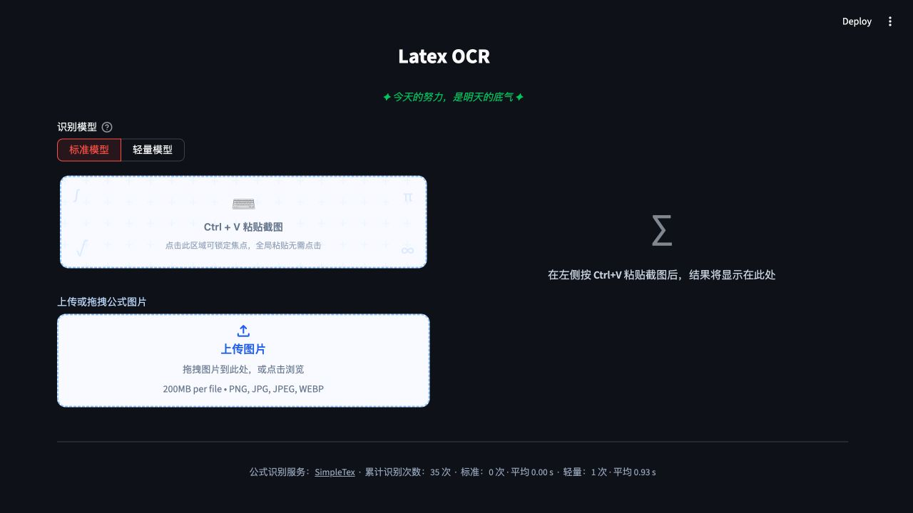
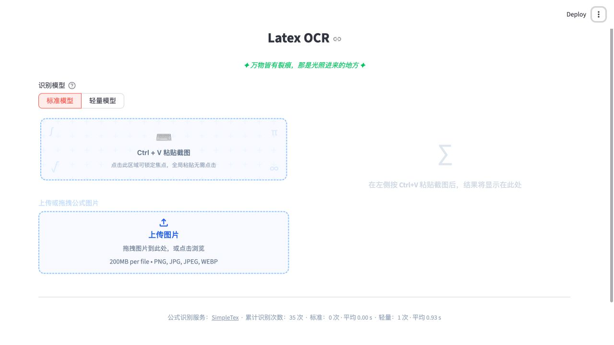

# 图片转公式

## 界面预览

### 深色主题



### 浅色主题



## 配置 SimpleTex

应用启动前，需在 [SimpleTex 开放平台](https://simpletex.cn/user/center) 创建应用，并配置其 APP ID 与 APP Secret：

```bash
export SIMPLETEX_APP_ID="你的 APP ID"
export SIMPLETEX_APP_SECRET="你的 APP Secret"
streamlit run app.py
```

部署到 Streamlit 时，也可以将同名字段配置在 `secrets.toml` 中。APP Secret 仅用于服务端请求签名，不会发送到浏览器或 SimpleTex 请求体。
